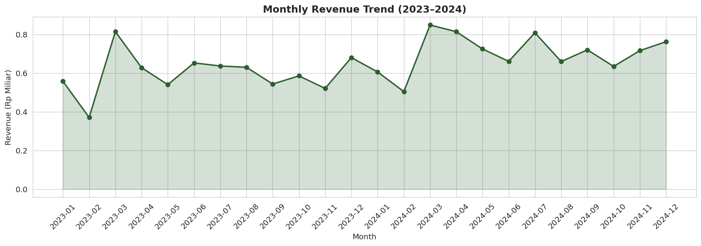
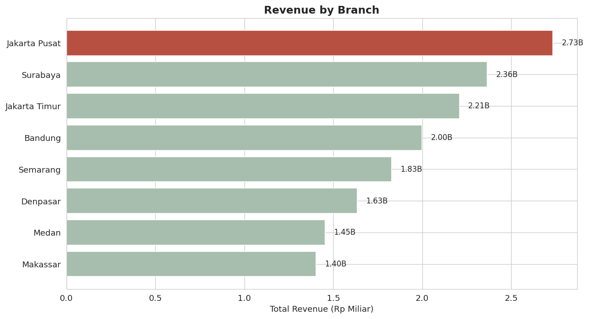
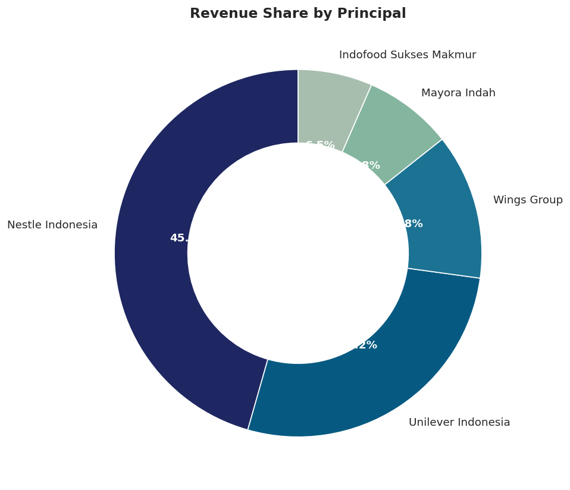
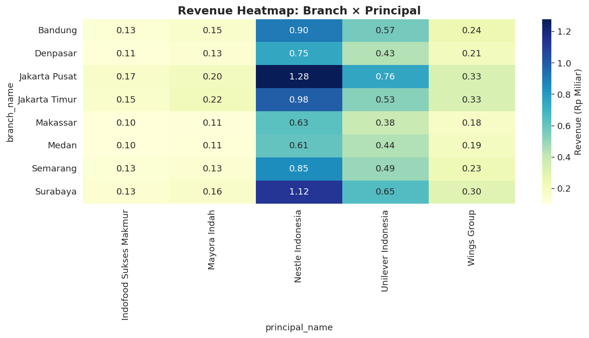

# 📊 FMCG Sales Performance Analysis

> **Data Analyst Portfolio Project** — End-to-end analysis of sales performance across branches, principals, and products in the Indonesian FMCG industry.


---

## 📌 Project Overview

Sebagai data analyst di industri FMCG, salah satu tanggung jawab utama adalah memantau **sales performance** lintas dimensi: cabang, principal (mitra/distributor), produk, dan waktu. Project ini melakukan analisis komprehensif terhadap data penjualan **2 tahun terakhir (2023–2024)** untuk menjawab pertanyaan bisnis kunci dan memberikan rekomendasi berbasis data.

**Data Coverage:**
- 📅 **Periode:** Januari 2023 – Desember 2024
- 🏢 **8 Cabang** di seluruh Indonesia
- 🤝 **5 Principal** (Unilever, Indofood, Wings, Mayora, Nestle)
- 📦 **25 Produk** lintas kategori (Personal Care, Food, Beverage, Home Care, Dairy)
- 💼 **~16.000 Transaksi**

---

## 🎯 Business Questions

1. Bagaimana **tren penjualan** tahunan & bulanan? Apakah ada pola seasonality?
2. **Cabang & region** mana yang paling profitable?
3. **Principal** mana yang berkontribusi terbesar terhadap revenue?
4. **Produk** apa yang menjadi best-seller dan mana yang slow-moving?
5. Apakah **target 2024** tercapai?
6. **YoY growth** seperti apa di tiap cabang?

---

## 🛠️ Tech Stack

| Tool | Purpose |
|------|---------|
| **SQL** (SQLite) | Data extraction, joining, aggregations, window functions |
| **Python** (Pandas, NumPy) | Data cleaning, transformation, EDA |
| **Matplotlib & Seaborn** | Statistical visualization |
| **Tableau** | Interactive dashboard |
| **Git & GitHub** | Version control & portfolio hosting |

---

## 📁 Project Structure

```
fmcg-sales-analysis/
├── data/
│   ├── generate_data.py              # Script generate dummy data
│   ├── branches.csv                  # Master cabang
│   ├── principals.csv                # Master principal
│   ├── products.csv                  # Master produk
│   └── sales_transactions.csv        # Fact table transaksi
│
├── sql/
│   ├── 01_schema_and_load.sql        # DDL + load CSV
│   ├── 02_data_cleaning.sql          # Profiling + cleaning
│   └── 03_business_analysis.sql      # 8 business questions
│
├── python/
│   └── fmcg_sales_analysis.ipynb     # Jupyter notebook (EDA & viz)
│
├── tableau/
│   ├── sales_clean_for_tableau.csv   # Clean data untuk Tableau
│   └── dashboard_guide.md            # Instruksi build dashboard
│
├── docs/
│   └── *.png                         # Generated charts
│
├── ppt/
│   └── FMCG_Sales_Analysis.pptx      # Presentation deck
│
└── README.md
```

---

## 🔍 Methodology

### 1️⃣ Data Preparation
- Load 4 CSV files: branches, principals, products, sales_transactions
- Initial inspection dengan `.info()`, `.describe()`, `.head()`

### 2️⃣ Data Cleaning
- ✅ Identifikasi **NULL values** di kolom kritis (quantity, revenue)
- ✅ Deteksi & hapus **duplicate transactions**
- ✅ Fix **negative quantities & revenue** (data error)
- ✅ Strip **whitespace** pada `branch_id`
- ✅ Convert `transaction_date` ke datetime
- ✅ Feature engineering: `gross_profit`, `margin_pct`, `year_month`, `quarter`

### 3️⃣ Data Modification (Joining)
- Merge sales_transactions → branches → products → principals
- Hasil: single denormalized table siap dianalisis

### 4️⃣ Business Analysis & Visualization
- 8 SQL queries untuk menjawab business questions
- Python visualizations: trend line, bar chart, donut, heatmap
- Tableau interactive dashboard

---

## 📊 Key Findings

| # | Finding | Impact |
|---|---------|--------|
| 1 | **Total Revenue** Rp 15.6 Miliar dengan margin 14% | Healthy baseline |
| 2 | **Jakarta Pusat** & **Surabaya** menyumbang >30% revenue | Top performer cabang |
| 3 | **Nestle** dominate dengan 46% share | Risk: over-reliance |
| 4 | **Dancow** & **Nescafe Classic** = best sellers | Volume + price champion |
| 5 | Lonjakan revenue di Maret–April (Ramadan) dan Desember | Seasonality clear |
| 6 | YoY growth 2024 vs 2023: rata-rata +12% | Above target |

---

## 💡 Recommendations

1. **Diversifikasi principal** — kurangi ketergantungan pada Nestle
2. **Boost performa cabang luar Jawa** (Sulawesi, Sumatera)
3. **Optimalkan Ramadan campaign** — alokasi inventory & marketing budget di Q1
4. **Review margin produk volume tinggi** — beberapa produk penjualan tinggi tapi profit tipis
5. **Real-time monitoring dashboard** — Tableau untuk decision making harian

---

## 📈 Sample Visualizations

### Monthly Revenue Trend


### Branch Performance


### Principal Share


### Branch × Principal Heatmap


---

## 🚀 How to Reproduce

```bash
# 1. Clone repository
git clone https://github.com/[your-username]/fmcg-sales-analysis.git
cd fmcg-sales-analysis

# 2. Install dependencies
pip install pandas numpy matplotlib seaborn jupyter

# 3. Generate data (atau pakai CSV yang sudah ada)
python data/generate_data.py

# 4. Run SQL analysis (gunakan SQLite atau DB pilihanmu)
sqlite3 fmcg.db < sql/01_schema_and_load.sql
sqlite3 fmcg.db < sql/02_data_cleaning.sql
sqlite3 fmcg.db < sql/03_business_analysis.sql

# 5. Run Python analysis
jupyter notebook python/fmcg_sales_analysis.ipynb

# 6. Open Tableau dashboard
# Import data: tableau/sales_clean_for_tableau.csv
# Follow guide: tableau/dashboard_guide.md
```

---

## 👤 About the Author

**[Your Name]** — Aspiring Data Analyst dengan pengalaman di industri FMCG (sales performance analysis).

**Skills:** SQL · Python · Tableau · Excel · Data Visualization · Storytelling

📧 **Contact:** [your.email@gmail.com]  
💼 **LinkedIn:** [linkedin.com/in/your-profile]  
🐙 **GitHub:** [github.com/your-username]

---

## 📜 License

MIT License — feel free to fork & adapt for your own portfolio.

> ⚠️ **Note:** Data dalam project ini adalah **dummy data** yang dibuat untuk keperluan portfolio. Tidak merepresentasikan data perusahaan manapun.
